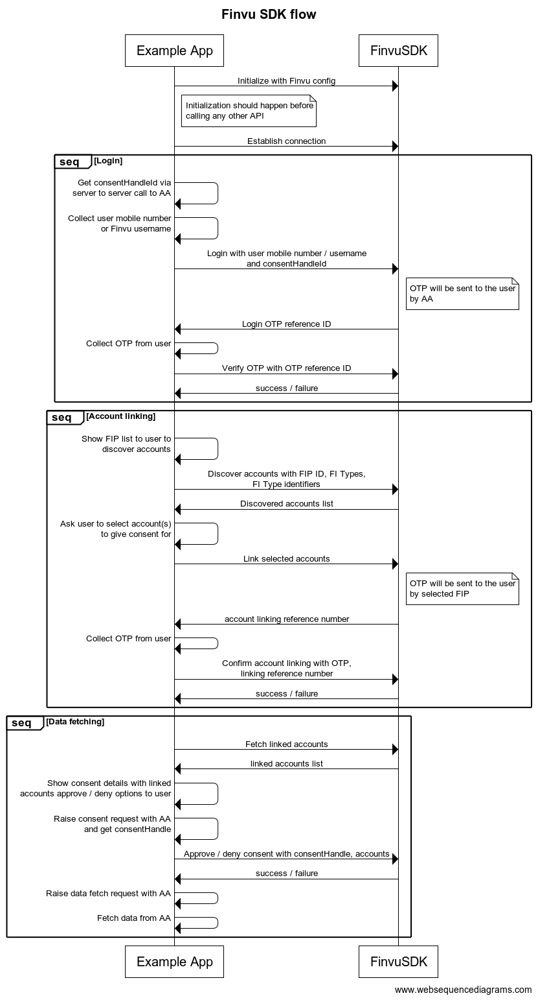

# Finvu Flutter Mobile SDK Integration Guide

## Table of Contents
1. [Introduction](#introduction)
2. [Prerequisites](#prerequisites)
3. [Installation](#installation)
4. [Accessing Finvu SDK APIs](#accessing-finvu-sdk-apis)
5. [Initialization](#initialization)
6. [Usage](#usage)
7. [Frequently Asked Questions](#frequently-asked-questions)

## Introduction
Welcome to the integration guide for Finvu Flutter SDK! This document provides detailed instructions on integrating our SDK into your flutter application.

## Prerequisites
1. Flutter
    1. Dart SDK version supported is >=3.3.0 <4.0.0
    2. Flutter version supported is >=3.3.0
2. Android
    1. Min SDK version supported is 24
    2. Min kotlin version supported is 1.9.0
3. iOS
    1. Min iOS version supported is iOS 13

## Installation
1. Add `finvu_flutter_sdk` and `finvu_flutter_sdk_core` dependencies in your `pubspec.yaml`
```
dependencies:
  flutter:
    sdk: flutter
  finvu_flutter_sdk:
    git:
      url: https://github.com/Cookiejar-technologies/finvu_ios_sdk.git
      path: client
      ref: 1.0.0
  finvu_flutter_sdk_core:
    git:
      url: https://github.com/Cookiejar-technologies/finvu_ios_sdk.git
      path: core
      ref: 1.0.0
```
2. On android add the following repository to your project level `build.gradle` file. Note that you need to provide some github credentials.
```
allprojects {
    repositories {
        google()
        mavenCentral()
        
        // Add these lines
        maven { 
            url 'https://maven.pkg.github.com/Cookiejar-technologies/finvu_flutter_sdk' 
            credentials {
                username = System.getenv("GITHUB_PACKAGE_USERNAME")
                password = System.getenv("GITHUB_PACKAGE_TOKEN")
            }
        }
    }
}
```
3. On iOS add the following to your `Podfile`
```
target 'Runner' do
  use_frameworks!
  use_modular_headers!

  ## Add this line
  pod 'FinvuSDK' , :git => 'https://github.com/Cookiejar-technologies/finvu_ios_sdk.git'

  flutter_install_all_ios_pods File.dirname(File.realpath(__FILE__))
end

```

## Accessing Finvu SDK APIs
`FinvuManager` class that should be used to access the APIs on the SDK. `FinvuManager` class is a singleton, and can be access as follows:
```
final FinvuManager finvuManager = FinvuManager(); // Factory constructor will always return the same instance
```

## Initialization
Initialize the SDK in your application's entry point (eg. splash screen). SDK can be initialized using the the following method.
```

finvuManager.initialize(FinvuConfig(finvuEndpoint: "wss://wsslive.finvu.in/consentapi"));
```

## Usage
Refer to the SDK documentation for detailed instructions on using various features and functionalities provided by the SDK. Below is the sequence diagram which includes SDK initialization, account linking and data fetch flows.


## Frequently Asked Questions
Q. On Android I am getting the error `Class 'com.finvu.android.publicInterface.xxxxx' was compiled with an incompatible version of Kotlin. The binary version of its metadata is 1.9.0, expected version is 1.7.1.` or similar. How do I fix it?

A. Ensure that in your `settings.gradle` file, has the kotlin version set to 1.9.0
```
plugins {
    id "dev.flutter.flutter-plugin-loader" version "1.0.0"
    id "com.android.application" version "7.3.0" apply false
    id "org.jetbrains.kotlin.android" version "1.9.0" apply false <--- check version here
}
```
